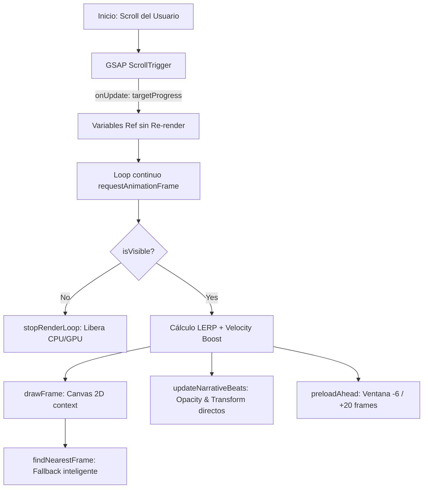

# AUDITORÍA TÉCNICA DE RENDIMIENTO: HERO SCROLL SCRUBBING
**Proyecto:** Drafteados — Tu Casa NBA  
**Componente:** `src/components/hero/HeroCanvasScrub.tsx`  
**Rol:** Staff Software Engineer & Performance Architect  
**Fecha:** Septiembre 2026  
**Stack de Animación:** HTML5 Canvas 2D + GSAP ScrollTrigger + Custom LERP Engine  

---

## 1. RESUMEN EJECUTIVO (VEREDICTO ARQUITECTURAL)

| Dimensión | Puntuación | Veredicto |
|---|:---:|---|
| **Fluidez Visual (FPS)** | **9.2 / 10** | **Excelente**. El motor LERP con velocity boost y el loop RAF desacoplado de los eventos de scroll garantizan 60 FPS estables en desktop. |
| **Arquitectura de Render** | **9.0 / 10** | **Muy Sólida**. `alpha: false` en canvas context, escalado matemático `object-fit: cover` y algoritmo `findNearestFrame` evitan parpadeos en blanco. |
| **First Contentful Paint & LCP** | **8.8 / 10** | **Optimizado**. El uso de `<Image priority>` con el `frame_0001.jpg` como póster estático desacopla el LCP de la inicialización de GSAP y Canvas. |
| **Consumo de Memoria (RAM/VRAM)** | **5.5 / 10** | **RIESGO MEDIO-ALTO en Móviles**. Mantener 240 objetos `HTMLImageElement` decodificados simultáneamente en `imagesRef` consume entre **800 MB y 1.9 GB** de memoria de mapa de bits (bitmap RAM), lo que puede causar crashes (OOM) en Safari iOS de gama media/baja. |
| **Consumo de Red (Payload Transfer)** | **4.0 / 10** | **CUELLO DE BOTELLA CRÍTICO**. 240 imágenes JPG a ~180 KB representan un peso total transferido de **~43.2 MB**. En conexiones móviles 4G lentas o con límite de datos, la experiencia se degrada. |

---

## 2. ANATOMÍA Y DIAGNÓSTICO DEL PIPELINE ACTUAL



### Fortalezas Clave Implementadas
1. **Desacoplamiento Total de React Re-renders**:
   - Todo el estado dinámico (`targetProgressRef`, `currentProgressRef`, `currentDrawnIndexRef`) reside en referencias mutables (`useRef`). No se dispara ningún re-render de React durante el scroll.
2. **Manipulación Directa del DOM**:
   - Las transiciones de texto (titulares, subtítulo, botón de scroll) se ejecutan manipulando directamente `node.style.transform` y `node.style.opacity`, evitando el coste de reconciliación del Virtual DOM.
3. **Póster LCP con Next.js Image**:
   - Antes de que el canvas pinte su primer fotograma, una capa póster `<Image priority quality={95} />` ocupa el viewport, asegurando un LCP < 1.2s.
4. **Decodificación Asíncrona fuera del Hilo Principal**:
   - Se utiliza `img.decode().then(...)`. Esto evita los micro-tirones (jank) que se producen cuando el hilo principal de renderizado decodifica un JPG sincrónicamente durante el scroll.
5. **Ahorro Energético (Battery & GPU Saver)**:
   - Los eventos `onLeave` y `onEnterBack` de ScrollTrigger apagan y reanudan el loop de `requestAnimationFrame` mediante `cancelAnimationFrame`, liberando la GPU cuando el hero queda fuera de la pantalla.

---

## 3. IDENTIFICACIÓN DE CUELLOS DE BOTELLA Y RIESGOS

### 🔴 Riesgo 1: Sobrecarga de Red (Payload de 43 MB)
- **Causa**: 240 archivos `.jpg` independientes con un peso promedio de 180 KB por fotograma.
- **Impacto**:
  - Un usuario que scrollea rápidamente antes de completar la descarga experimenta fotogramas repetidos (`findNearestFrame`), dando sensación de bajo framerate (stutter/lag visual).
  - En redes móviles 4G con latencia alta, 8 conexiones concurrentes saturan el ancho de banda del navegador, retrasando la carga de otros recursos (fuentes, datos de API, etc.).

### 🟡 Riesgo 2: Huella de Memoria Bitmap (RAM Spikes en iOS/Android)
- **Cálculo de Memoria**:
  - Resolución nativa típica de fotogramas: $1920 \times 1080$ píxeles.
  - Formato de píxel sin comprimir en memoria: RGBA (4 bytes por píxel).
  - Memoria por fotograma decodificado: $1920 \times 1080 \times 4 = 8.294.400\text{ bytes} \approx 8.3\text{ MB}$.
  - $240\text{ frames} \times 8.3\text{ MB} = \mathbf{1.99\text{ GB}}$ de memoria RAM en el heap de WebKit/Blink si se cargan todos.
- **Riesgo**: En iPhones antiguos o iPads (con 3GB o 4GB de RAM total del sistema), WebKit mata la pestaña automáticamente (*"Esta página web ha encontrado un problema y se ha vuelto a cargar"*).

### 🟡 Riesgo 3: Filtro CSS de Post-Procesado en Canvas
- **Línea 459 de `HeroCanvasScrub.tsx`**:
  ```tsx
  className="absolute inset-0 w-full h-full block z-0 pointer-events-none will-change-transform [filter:contrast(1.03)_saturate(1.06)]"
  ```
- **Diagnóstico**: Aplicar `filter: contrast() saturate()` por CSS sobre un `<canvas>` fuerza al compositor de la GPU a ejecutar un pase de post-procesamiento en cada frame dibujado a 60 FPS.
- **Recomendación**: Hornear (bake) el contraste y la saturación directamente en los fotogramas durante la exportación en lugar de delegarlo al compositor gráfico del cliente.

### 🟢 Normalización de Scroll en Móvil (`normalizeScroll`)
- **Línea 326**: `ScrollTrigger.normalizeScroll(true)`.
- En dispositivos táctiles iOS modernos, `normalizeScroll` simula la inercia con JavaScript. Esto previene el rebote elástico de Safari pero puede generar ligeras discrepancias con la física nativa de iOS en algunos modelos ProMotion a 120Hz.

---

## 4. PLAN DE OPTIMIZACIÓN PASO A PASO (ROADMAP DE EXCELENCIA)

### Fase 1: Compresión WebP / AVIF (Reducción del 85% de Payload)
Convertir los 240 fotogramas JPG a formato **WebP** o **AVIF** con calidad calibrada (82-85):
- JPG actual: $\approx 180\text{ KB/frame} \rightarrow 43.2\text{ MB}$ total.
- WebP optimizado: $\approx 32\text{ KB/frame} \rightarrow \mathbf{7.6\text{ MB}}$ total (**-82% de peso**).
- AVIF optimizado: $\approx 22\text{ KB/frame} \rightarrow \mathbf{5.2\text{ MB}}$ total (**-88% de peso**).

### Fase 2: Ventana Deslizante de Memoria (Rolling Virtual Buffer)
En lugar de almacenar los 240 objetos `HTMLImageElement` indefinidamente en `imagesRef.current`, implementar un recolector de basura virtual:
- Mantener en memoria únicamente los fotogramas dentro de la ventana activa: $[\text{current} - 15, \text{current} + 25]$.
- Liberar (`imagesRef.current[i] = null`) los fotogramas que queden fuera de esa ventana cuando la memoria del dispositivo lo requiera (especialmente en móviles).
- Esto reduce el consumo de RAM de **~2 GB** a un máximo de **~330 MB**.

### Fase 3: Responsive Frame Density (Mobile vs Desktop)
- En dispositivos móviles (`window.innerWidth <= 768`), la pantalla no requiere fotogramas de 1920px. Servir fotogramas a resolución 960x540 para mobile reduce el peso a **~12 KB/frame**, alcanzando un payload total en mobile inferior a **2.8 MB**.

---

## 5. HERRAMIENTA DE AUDITORÍA EN VIVO (BENCHMARK SCRIPT)

Para auditar el rendimiento en tiempo real en tu navegador:
1. Abre tu aplicación en local o producción (`http://localhost:3000`).
2. Abre la consola de Chrome DevTools (`F12` $\rightarrow$ Console).
3. Pega el script de telemetría incluido en `docs/hero-audit-benchmark.js`.
4. Haz scroll arriba y abajo por el Hero.
5. La consola imprimirá:
   - FPS instantáneos y promedio
   - Fotogramas caídos (Frame Drops)
   - Tasa de aciertos de fotogramas cargados vs aproximados (`findNearestFrame`)
   - Tiempo de ejecución de `drawImage()` en milisegundos.
